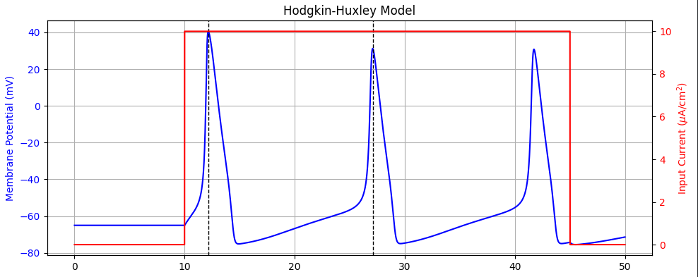
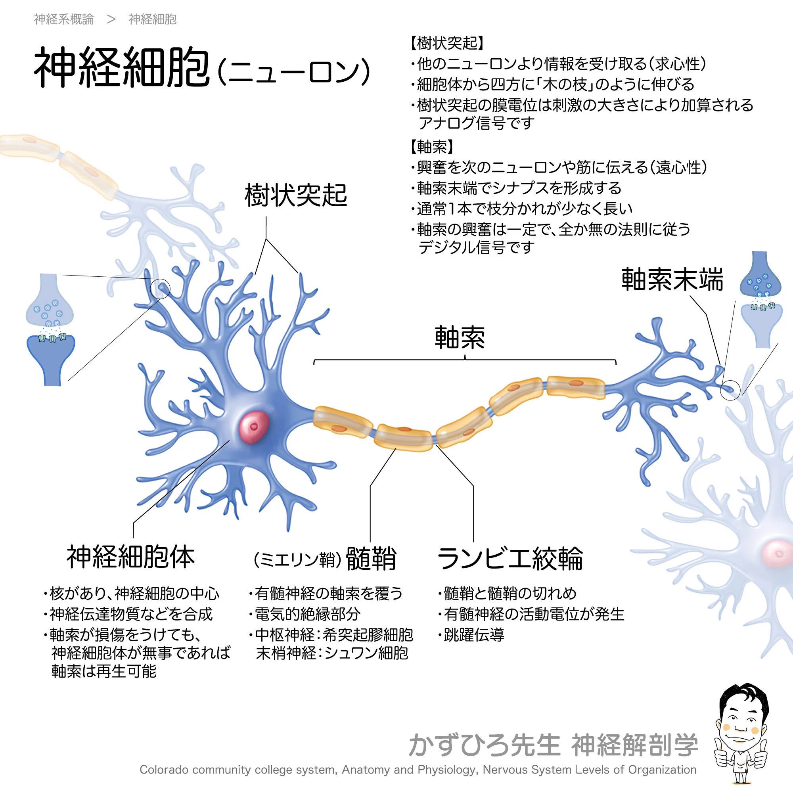
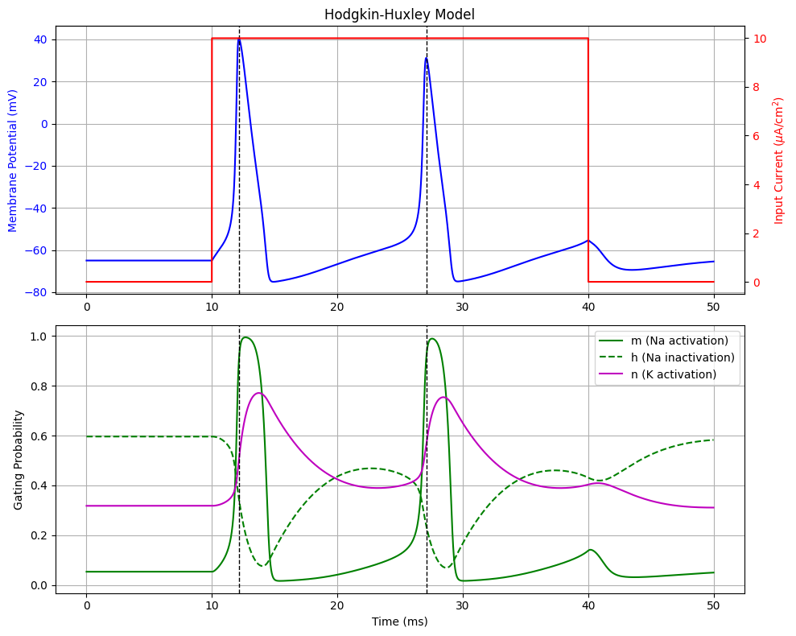
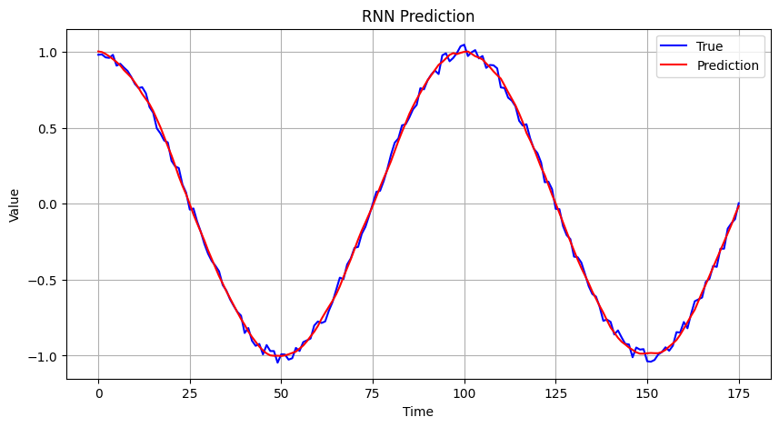

# RNN Neuro Surrogate
### RNNを用いた神経細胞モデル（Hodgkin–Huxleyモデル）の代理モデル構築による高速シミュレーション
## 研究目的
- 脳の大規模シミュレーションを行うにあたって，以下の2つを満たしつつ，膜電位応答を再現できるMulti Compartmentモデルの代理モデル（surrogate model）の構築を目指す．
    - 時間計算量を削減
    - GPUよって高速処理が可能
- 本研究では、RNN(リカレントニューラルネットワーク)を用いてMulti Compartmentモデルに対する代理モデルを構築する
## 背景
### 脳
- 脳は生物の思考や行動などの情報処理を司る
    - この機能はニューロンのネットワークを介したスパイク伝播によってなされる[1]．
        - スパイク：ニューロンの膜電位がスパイク状に急上昇すること
            - 隣接するニューロンがスパイクを起こす
            - イオン電流を刺激として受けることで膜電位が上昇
            - 膜電位が閾値を超えると，イオンチャネルが一気に開いて膜電位が急上昇（スパイク）する．
            - ここで流入チャネルが閉じ，流出チャネルが開くため，膜電位がそれ以上上がることはない．
            - 発生した電気信号は軸索を伝わり，隣接ニューロンへと送り出される
            - HHモデルのシミュレーションを用いた詳しいニューロン発火の流れの説明は「猿でもわかるニューロン発火 by Hodgkin,Huxley and Yamashita(2026/07/06)」を参照

- スパイク伝播を観測することで，脳の情報処理過程を知ることができる一方，脳を構成する約1000億個のニューロンをすべて同時に観測する必要があり，不可能．
- 個別のニューロンの挙動については多くのことが知られている．
    - ニューロンの振る舞いを記述する数理モデルを組み合わせた脳モデルを作り，シミュレーションを行うことも可能
    
    
### Multi-Compartmentモデル
- 実際のニューロンは空間形状を持っており，膜電位のイオンチャネルの種類や膜電位の値は位置に応じて異なる．

- 単一ニューロンの機能には，空間形状が大きく関わっているものもある
    - 刺激シーケンスの弁別
        - 時間的・空間的な順序（シーケンス）を持つ複数の刺激のパターンや流れを聞き分け,それぞれ異なる反応を示す
    - 排他的論理和の演算（非線形な演算である）
- ニューロンを複数のコンパートメントで表現し,各コンパートメントは膜電位と複数の隠れ変数を保持するため,多くのメモリを必要とする[1]．
- マウス脳規模（約10^8～10^9個のニューロン）のシミュレーションでも、スーパーコンピュータ富岳でも扱いきれないほど空間計算量が増大する[5]．
- 大規模脳シミュレーションの実現には，ニューロンモデルの空間計算量削減が重要である．

### RNN
#### 時系列データ
- RNNでは、並びに規則性・パターンがある（または、ありそうに見える）データを学習することで未知の時系列データが与えられたとき、そのデータの未来の状態を予測する。
#### 過去の隠れ層
- 時系列データを保持するためには、過去の状態をモデル内で保持しておく必要
- 現在に対する過去からの目に見えない影響を把握しておく必要
- これらを過去の隠れ層として定義
- 一般的なNN:入力層$\mathbb{x}(t)$-隠れ層$\mathbb{h}(t)$-出力層$\mathbb{y}(t)$
- RNN:時刻$t-1$における隠れ層の値$\mathbb{h}(t-1)$を保持しておき、それも$\mathbb{h}(t)$に伝える
- 隠れ層に過去の状態がすべて反映されている
- 隠れ層に過去の状態がすべて反映されている

#### GPUとの相性
- RNN内部で行われる計算は行列演算
    - $\mathbb{h}(t)=f(W\mathbb{x}(t)+U\mathbb{h}(t-1))+\mathbb{b}$
    - $\mathbb{y}(t)=g(V\mathbb{h}(t))+\mathbb{c}$
- Tensorコアなどの行列計算アクセラレータを使えば，CPUを使って連立微分方程式を解くより高速な処理ができるのでは？という目論見

### Hodkin-Hukslayモデル
1952年 イギリスケンブリッジ大学 A.L.Hodkin ＆ A.F.Hukslayが，イカの巨大軸索の活動電位と，$Na^+$チャネル、$K^{+}$チャネルの開閉を電位固定法を用いた実験によって測定
- ニューロンを空間上の1点として表現
- 多入力を受け，和をとり，閾値を超えるかどうかを判定し，スパイクを発生させるという機構は実現可能
- 入力電流に対するイオンチャネルの開閉（膜のコンダクタンス）と膜電位の上下動を非線形連立微分方程式によって表現
$$

\begin{aligned}
C\frac{dV}{dt}
&=
-g_{\mathrm{leak}}(V(t)-E_{\mathrm{leak}})
-g_{\mathrm{Na}}(V,t)(V(t)-E_{\mathrm{Na}})
-g_{\mathrm{K}}(V,t)(V(t)-E_{\mathrm{K}})
+I_{\mathrm{ext}}(t)
\\[6pt]
\end{aligned}
$$
$$
\begin{cases}
g_{\mathrm{Na}}(V,t)
&=
\bar{g}_{\mathrm{Na}}\,m^{3}(V,t)h(V,t)
\\[6pt]
g_{\mathrm{K}}(V,t)
&=
\bar{g}_{\mathrm{K}}\,n^{4}(V,t)
\end{cases}
$$

$$
\begin{cases}
\frac{d}{dt} m(V,t) &= \alpha_m(V)(1 - m(V,t)) - \beta_m(V)m(V,t) \\
\frac{d}{dt} h(V,t) &= \alpha_h(V)(1 - h(V,t)) - \beta_h(V)h(V,t) \\
\frac{d}{dt} n(V,t) &= \alpha_n(V)(1 - n(V,t)) - \beta_n(V)n(V,t)
\end{cases}
$$
$$
\begin{cases}
\alpha_m(V) &= \frac{2.5 - 0.1V}{\exp(2.5 - 0.1V) - 1} \\[1.5ex]
\beta_m(V) &= 4 \exp\left(-\frac{V}{18}\right) \\[1.5ex]
\alpha_h(V) &= 0.07 \exp\left(-\frac{V}{20}\right) \\[1.5ex]
\beta_h(V) &= \frac{1}{\exp(3 - 0.1V) + 1} \\[1.5ex]
\alpha_n(V) &= \frac{0.1 - 0.001V}{\exp(1 - 0.1V) - 1} \\[1.5ex]
\beta_n(V) &= 0.125 \exp\left(-\frac{V}{80}\right)
\end{cases}
$$

## 研究の現在位置
- Hodkin-Hukslayモデルの数値シミュレーション（済）
    - まずは空間形状をもたない単一ニューロンの発火を確認した
    - 詳しくは「猿でもわかるニューロン発火 by Hodgkin,Huxley and Yamashita(2026/07/06)」を参照
    
- RNN実装
    - Pytouchを使った簡単なRNNを実装した
    - sin関数の学習に成功
    - 25ステップ分の過去の波形の塊を、時間を1ステップずつずらしながら
    
- HH × RNN　←今ここ
  - パルス電流をHHに入力
  - パルス入力電流 $I$ に対するHHの出力 $V$ をRNNに学習させる
  -  $I$ と $V$ の組だけでは学習が難しい場合
      - 一部HH，一部RNNのハイブリッド
      -  $I$ と $V$ だけでなく，パラメータ $g,m,n,h,\alpha,\beta$なども学習させる（詳しくはREAD MEに）
  - 同時進行で簡単なMulti Compertmentモデルを実装
- Multi Compertment実装 ～2026年 8/10
- Multi Compertment × RNN 〜2026年末
  - RNNに何を学習させるかを決める
  - 検証・評価
  - できれば大規模シミュレーションしてみたい
- 卒論執筆 〜2027年3月
- 修士過程からはより複雑なMulti CompertmentをRNNに学習させる
    

## 参考文献
- [1]
- [2]
- [3]
- [4]
- [5]
- [6]
# 参考文献
[^1]：山﨑 匡 and 五十嵐 潤. はじめての神経回路シミュレーション:1ニューロンからヒト全脳モ
デルまで. 森北出版株式会社,2021年12月22日, pp. 56–61.

[^2] Eric R. Kandel et al. カンデル神経科学. 第2版. メディカル・サイエンス・インターナショ
ナル, 2022, p. 57.

[^3] Gidon Albert. Dendritic Action Potentials and Computation in Human Layer 2/3 Corti
cal Neurons | Science. https://www.science.org/doi/10.1126/science.aax6239. Jan. 2020.
(Visited on 09/05/2024).

[^4] Tiago Branco, Beverley A. Clark, and Michael Häusser. “Dendritic Discrimination of
Temporal Input Sequences in Cortical Neurons”. In: Science (New York, N.Y.) 329.5999
(Sept. 2010), p. 1671. doi: 10.1126/science.1189664. (Visited on 09/05/2024).

[^5] Kaaya, Tamura Akira, and Rin Kuriyama. “Development of a lightweight and cus
tomizable biophysical neuron simulator”. 2024. url: https : / / researchmap . jp /
tairakobayashi/presentations/48836360.

[^6] A. L. Hodgkin and A. F. Huxley. “A Quantitative Description of Membrane Current
and Its Application to Conduction and Excitation in Nerve”. In: The Journal of Physi
ology 117.4 (Aug. 1952), pp. 500–544. issn: 0022-3751. doi: 10.1113/jphysiol.1952.
sp004764.

[^7] 棟近先輩の卒論
