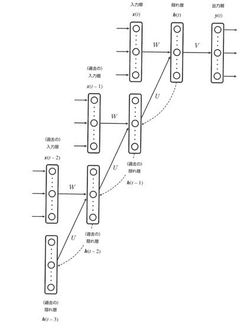
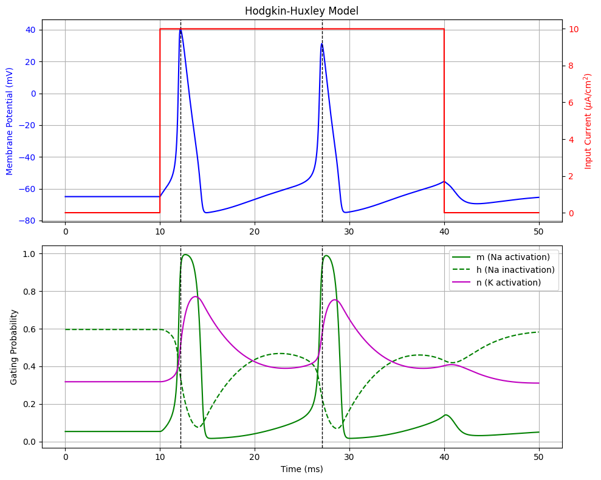
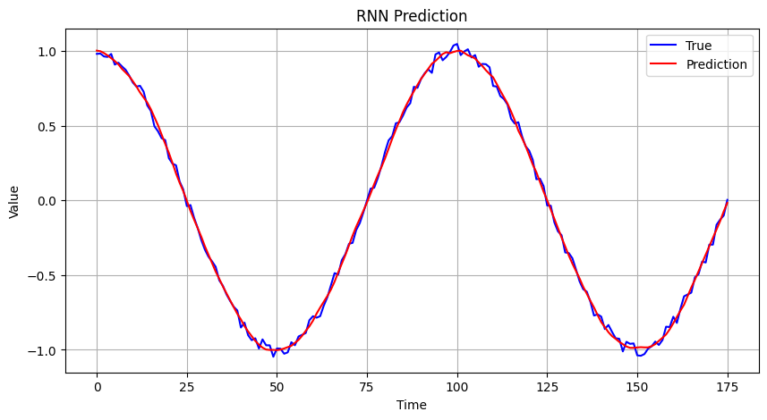
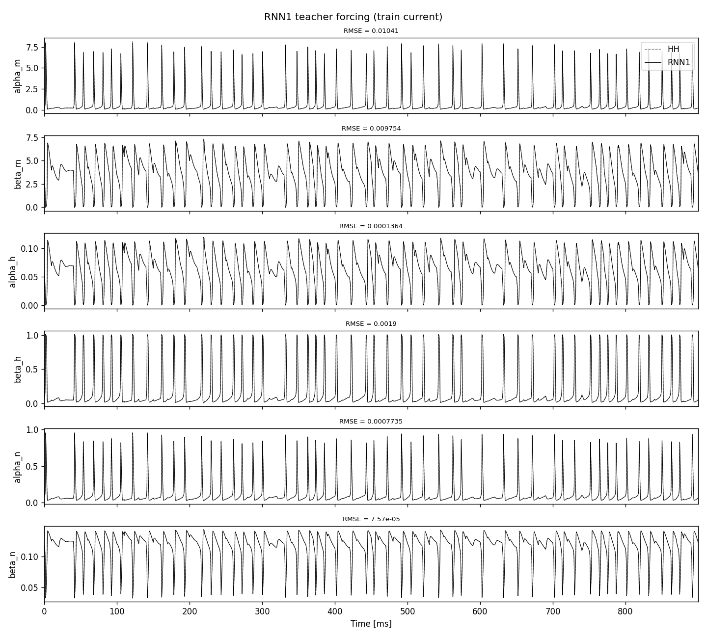
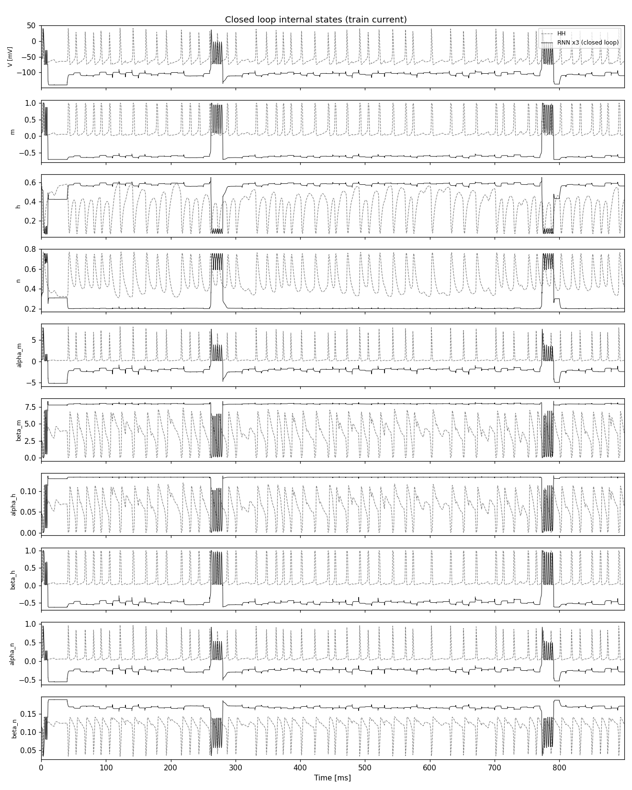

# RNN Neuro Surrogate
### RNNを用いた神経細胞モデル（Multi-Compertmentモデル）の代理モデル構築による高速シミュレーション
微分方程式で記述されるニューロンモデルをRNNを用いた代理モデルで近似し、高速シミュレーションを実現する研究です。

# 卒業研究

## 進捗状況
[PROGRESS.md](PROGRESS.md) を確認してください。


## フォルダ構成

```
.
├── src/                 研究コードのライブラリ部分（実験から import して使う）
│   ├── neuron/          HHモデルの数値計算（hh.py）と入力電流の生成（current.py）
│   ├── rnn/             NumPy だけで書いた RNN（モデル・BPTT・最適化・学習ループ）
│   └── evaluation/      波形・スパイクの評価指標（waveform.py）と演算回数の比較（opcost.py）
├── experiments/         src/ を使って実際に動かすスクリプト
│   ├── hh/              HH の動作確認（run_hh.py）と教師データ作成（make_dataset.py）
│   ├── sin_wave/        RNN の動作確認として sin 波を学習させる実験
│   └── hh_surrogate/    HH の代理モデルの実験（実験設定は 学習タスク.md）
│       ├── hh_surrogate.py  モデル1：RNN 1個で I(t) → V(t+dt)
│       └── hh_modular.py    モデル2：HH の式の構造に合わせた RNN 3個
├── data/hh/             make_dataset.py が作る教師データ（.npz）
├── results/             実験の出力（図・学習済みパラメータ・評価指標 metrics.json）
├── thesis/              卒業論文（.tex / .pdf）と発表スライド
├── docs/                README 用の図、RNN の設計メモ、タスク表
├── notes/               勉強ノート（数値解析・深層学習ゼミなど）
├── references/          関連論文と論文紹介の原稿
└── PROGRESS.md          進捗と今後の予定
```

## 実行方法

[uv](https://docs.astral.sh/uv/) で依存関係（numpy, matplotlib）を入れて、リポジトリ直下から実行する。

```bash
uv sync
uv run python -X utf8 experiments/hh/make_dataset.py                          # HH の教師データを data/hh/ に作る
uv run python -X utf8 experiments/sin_wave/sin_wave.py                        # sin 波の学習（results/sin_wave/）
uv run python -X utf8 experiments/hh_surrogate/hh_surrogate.py --epochs 1000  # モデル1（results/hh_surrogate/）
uv run python -X utf8 experiments/hh_surrogate/hh_modular.py train --block 1  # モデル2 の RNN1 を学習
uv run python -X utf8 experiments/hh_surrogate/hh_modular.py train --block 2  # モデル2 の RNN2 を学習
uv run python -X utf8 experiments/hh_surrogate/hh_modular.py train --block 3  # モデル2 の RNN3 を学習
uv run python -X utf8 experiments/hh_surrogate/hh_modular.py eval             # 3つをつないで評価（results/hh_modular/）
```

## 背景
### 脳
- 脳の情報処理は，ニューロン間で伝達される電気信号（スパイク）によって実現される[1]。
- ニューロンの活動をシミュレーションすることで，脳の情報処理機構を解析する研究が行われている。
- 実際の脳には約1000億個のニューロンが存在するため，全ニューロンを直接観測することは困難である。
- そのため，ニューロンを数理モデルとして表現し，シミュレーションによって解析する手法が広く用いられている
    
    
### Multi-Compartmentモデル
- 高精度なニューロンモデルとして，Multi-Compartmentモデルが利用されている。
- ニューロンを複数のコンパートメントに分割し，各コンパートメントの膜電位や状態変数を計算することで，形状を考慮した電位伝播を再現できる。
- 単一コンパートメントモデルでは表現できない
  - 樹状突起での入力統合
  - 時間的・空間的な刺激シーケンスの弁別
  - 非線形演算（XOR演算など）
  を再現できる。
- 一方，各コンパートメントごとに状態変数を保持し，連立微分方程式を数値積分する必要があるため，
  - 計算量
  - メモリ使用量
  が非常に大きい。
- 大規模脳シミュレーションでは，この計算コストが大きな課題となっている．

### RNN
#### 時系列データ
- RNNでは、並びに規則性・パターンがある（または、ありそうに見える）データを学習することで未知の時系列データが与えられたとき、そのデータの未来の状態を予測する。
#### 過去の隠れ層
- 時系列データを保持するためには、過去の状態をモデル内で保持しておく必要
- 現在に対する過去からの目に見えない影響を把握しておく必要
- これらを過去の隠れ層として定義
- 一般的なNN:入力層$\mathbb{x}(t)$-隠れ層$\mathbb{h}(t)$-出力層$\mathbb{y}(t)$
- RNN:時刻$t-1$における隠れ層の値$\mathbb{h}(t-1)$を保持しておき、それも$\mathbb{h}(t)$に伝える
- 隠れ層に過去の状態がすべて反映されている
- 隠れ層に過去の状態がすべて反映されている


#### RNNを用いる理由

#### ① 内部状態を保持できる

- Multi-Compartmentモデルでは，現在の膜電位は現在の入力だけでなく，過去の膜電位や各コンパートメントの状態にも依存する。
- RNNは隠れ状態（Hidden State）として過去の情報を保持できる。
- 動的システムの状態遷移を自然に学習できるため，サロゲートモデルとして適している。

---

#### ② 時系列データとの親和性

- 膜電位は時間とともに変化する時系列データである。
- RNNは時系列データの時間相関を学習するニューラルネットワークである。
- Multi-Compartmentモデルの時間発展を近似するモデルとして適している。

---

#### ③ GPUによる高速化

- RNNの学習・推論は主に行列演算で構成される。
    - $\mathbb{h}(t)=f(W\mathbb{x}(t)+U\mathbb{h}(t-1))+\mathbb{b}$
    - $\mathbb{y}(t)=g(V\mathbb{h}(t))+\mathbb{c}$
- GPUは行列演算を高速に実行できるため，CPUによる数値積分より高速な推論が期待できる。
- サロゲートモデル化することで，大規模脳シミュレーションの高速化が期待される。

### Hodkin-Hukslayモデル
1952年 イギリスケンブリッジ大学 A.L.Hodkin ＆ A.F.Hukslayが，イカの巨大軸索の活動電位と，$Na^+$チャネル、$K^{+}$チャネルの開閉を電位固定法を用いた実験によって測定
- ニューロンを空間上の1点として表現
- 多入力を受け，和をとり，閾値を超えるかどうかを判定し，スパイクを発生させるという機構は実現可能
- 入力電流に対するイオンチャネルの開閉（膜のコンダクタンス）と膜電位の上下動を非線形連立微分方程式によって表現
$$

\begin{aligned}
C\frac{dV}{dt}
&=
-g_{\mathrm{leak}}(V(t)-E_{\mathrm{leak}})
-g_{\mathrm{Na}}(V,t)(V(t)-E_{\mathrm{Na}})
-g_{\mathrm{K}}(V,t)(V(t)-E_{\mathrm{K}})
+I_{\mathrm{ext}}(t)
\\[6pt]
\end{aligned}
$$
$$
\begin{cases}
g_{\mathrm{Na}}(V,t)
&=
\bar{g}_{\mathrm{Na}}\,m^{3}(V,t)h(V,t)
\\[6pt]
g_{\mathrm{K}}(V,t)
&=
\bar{g}_{\mathrm{K}}\,n^{4}(V,t)
\end{cases}
$$


$$
\begin{cases}
\frac{d}{dt} m(V,t) &= \alpha_m(V)(1 - m(V,t)) - \beta_m(V)m(V,t) \\
\frac{d}{dt} h(V,t) &= \alpha_h(V)(1 - h(V,t)) - \beta_h(V)h(V,t) \\
\frac{d}{dt} n(V,t) &= \alpha_n(V)(1 - n(V,t)) - \beta_n(V)n(V,t)
\end{cases}
$$
$$
\begin{cases}
\alpha_m(V) &= \frac{2.5 - 0.1V}{\exp(2.5 - 0.1V) - 1} \\[1.5ex]
\beta_m(V) &= 4 \exp\left(-\frac{V}{18}\right) \\[1.5ex]
\alpha_h(V) &= 0.07 \exp\left(-\frac{V}{20}\right) \\[1.5ex]
\beta_h(V) &= \frac{1}{\exp(3 - 0.1V) + 1} \\[1.5ex]
\alpha_n(V) &= \frac{0.1 - 0.001V}{\exp(1 - 0.1V) - 1} \\[1.5ex]
\beta_n(V) &= 0.125 \exp\left(-\frac{V}{80}\right)
\end{cases}
$$

## 研究の現在位置
- Hodkin-Hukslayモデルの数値シミュレーション（済）
    - まずは空間形状をもたない単一ニューロンの発火を確認した
    - 詳しくは「[猿でもわかるニューロン発火 by Hodgkin,Huxley and Yamashita(2026/07/06)](notes/saru_series/猿でもわかるニューロン発火by-Hodgkin-Huxley-and-Yamashita.md)」を参照
    
- RNN実装
    - Pytouchを使った簡単なRNNを実装した
    - sin関数の学習に成功
    - 25ステップ分の過去の波形の塊を、時間を1ステップずつずらしながら
    
- HH × RNN　←今ここ
  - 教師データ（済）：10 ms ごとに 0〜20 µA/cm² で値が変わる階段状の電流を HH に入れ，900 ms（dt = 0.01 ms）計算した
  - 構造の違う2つのモデルを NumPy で自作した RNN で作り，学習に使っていない6種類の電流（定常・ランプ・sin・パルス）でも評価している。設定の詳細は [学習タスク.md](experiments/hh_surrogate/学習タスク.md)
  - モデル1：RNN 1個で $I(t) \to V(t+dt)$ を学習（済）
      - どの電流でも RNN はスパイクを1発も出せていない（RMSE 7〜24 mV）
  - モデル2：HH の式の構造に合わせて RNN を3つに分けた（済）
      - RNN1： $V(t) \to \alpha, \beta(t)$
      - RNN2： $\alpha, \beta(t),\ m, h, n(t) \to m, h, n(t+dt)$
      - RNN3： $m, h, n(t),\ V(t),\ I(t) \to V(t+dt)$
      - 各ブロックに正解を入れたとき（教師強制）は，HH とほぼ重なる
      
      - 3つをつなぎ，出した値を次の時刻の入力に戻して回すと（閉ループ），最初の数発のあと $V$ が約 −110 mV に落ちて戻らない（RMSE 31〜59 mV）
      
      - どのブロックの誤差が積み重なって崩れるのかを，1ステップの変化量の対応図（`results/hh_modular/block{n}_parity.png`）で調べている
  - 同時進行で簡単なMulti Compertmentモデルを実装
- Multi Compertment実装 ～2026年 8/10
- Multi Compertment × RNN 〜2026年末
  - RNNに何を学習させるかを決める
  - 検証・評価
  - できれば大規模シミュレーションしてみたい
- 卒論執筆 〜2027年3月
- 修士過程からはより複雑なMulti CompertmentをRNNに学習させる
    


# 参考文献
[^1]：山﨑 匡 and 五十嵐 潤. はじめての神経回路シミュレーション:1ニューロンからヒト全脳モ
デルまで. 森北出版株式会社,2021年12月22日, pp. 56–61.


[^2] Eric R. Kandel et al. カンデル神経科学. 第2版. メディカル・サイエンス・インターナショ
ナル, 2022, p. 57.

[^3] Gidon Albert. Dendritic Action Potentials and Computation in Human Layer 2/3 Corti
cal Neurons | Science. https://www.science.org/doi/10.1126/science.aax6239. Jan. 2020.
(Visited on 09/05/2024).

[^4] Tiago Branco, Beverley A. Clark, and Michael Häusser. “Dendritic Discrimination of
Temporal Input Sequences in Cortical Neurons”. In: Science (New York, N.Y.) 329.5999
(Sept. 2010), p. 1671. doi: 10.1126/science.1189664. (Visited on 09/05/2024).

[^5] Kaaya, Tamura Akira, and Rin Kuriyama. “Development of a lightweight and cus
tomizable biophysical neuron simulator”. 2024. url: https : / / researchmap . jp /
tairakobayashi/presentations/48836360.

[^6] A. L. Hodgkin and A. F. Huxley. “A Quantitative Description of Membrane Current
and Its Application to Conduction and Excitation in Nerve”. In: The Journal of Physi
ology 117.4 (Aug. 1952), pp. 500–544. issn: 0022-3751. doi: 10.1113/jphysiol.1952.
sp004764.

[^7] 棟近先輩の卒論
