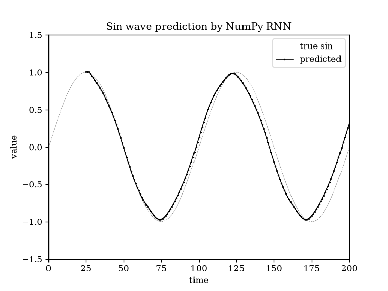
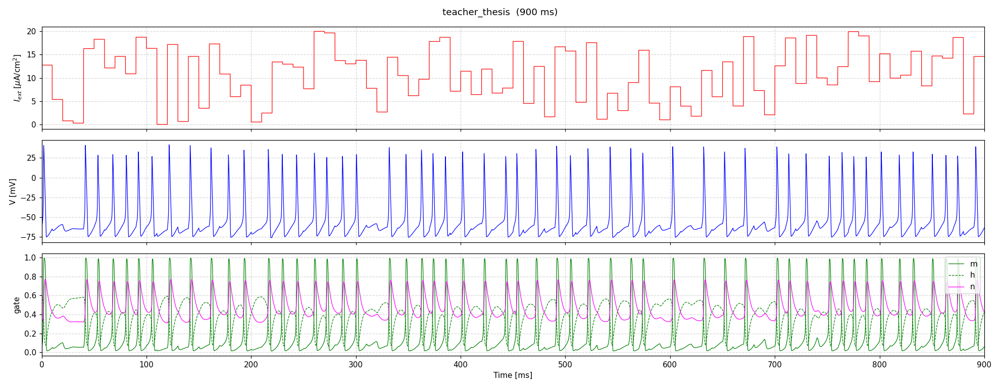
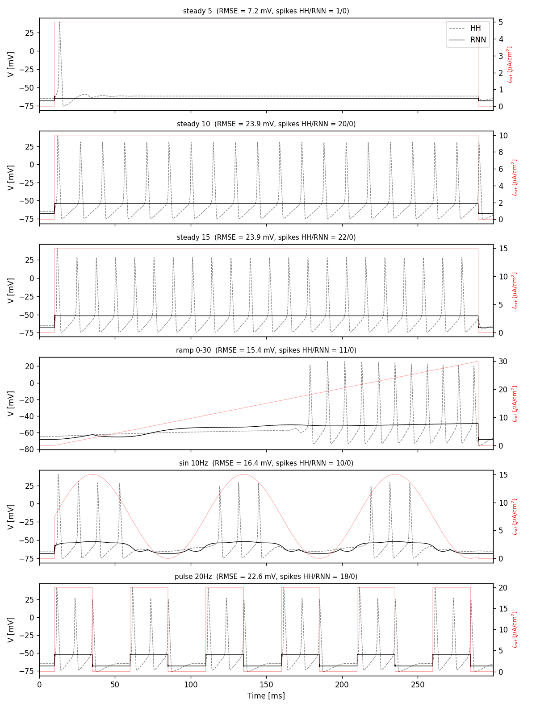
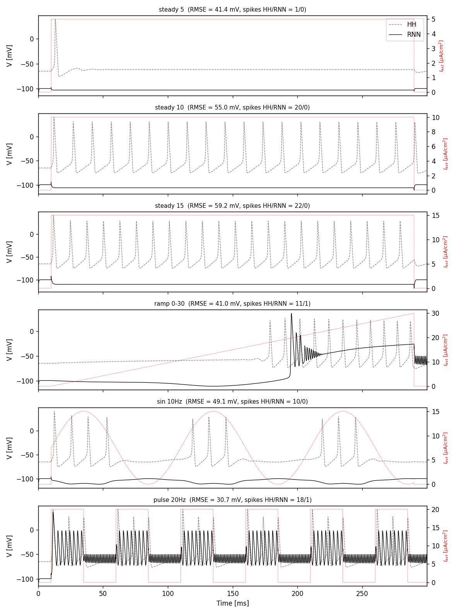
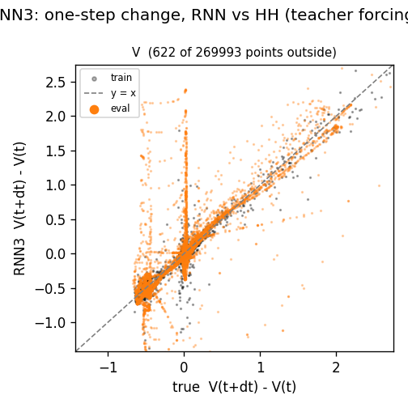

# RNN Neuro Surrogate
### 神経細胞シミュレーションの計算コスト削減を目的とした RNN 代理モデルの構築

大規模な脳シミュレーションでは、ニューロンモデルの微分方程式を数値積分する計算と、モデルが持つ状態変数を保存するメモリが大きな負担になる。本研究では、ニューロンモデルの入力電流に対する膜電位の応答を RNN（Recurrent Neural Network）で再現する代理モデルを作り、計算コストを削減する方法を探す。最終的な対象は Multi-Compartment モデルである。まず、より単純な Hodgkin-Huxley（HH）モデルで、RNN の代理モデルが成り立つかを確かめている。

| 項目 | 内容 |
|---|---|
| 対象 | HH モデル（いずれは Multi-Compartment モデル） |
| 代理モデル | Elman 型 RNN。PyTorch などを使わず、NumPy だけで実装した |
| 比べる構造 | モデル1：RNN 1 個で $I \to V$ ／ モデル2：HH の式に合わせて RNN を 3 つに分けたもの |
| 評価 | 波形の誤差、スパイクの数・間隔・形、1 ステップあたりの演算回数 |
| 現状 | どちらのモデルも、自分の出力を入力に戻して回すとスパイクを再現できない（[結果](#結果)） |

進捗の詳細は [PROGRESS.md](PROGRESS.md)、実験設定の詳細は [学習タスク.md](experiments/hh_surrogate/学習タスク.md) を参照。

## 目次
- [背景](#背景)
- [方法](#方法)
- [結果](#結果)
- [今後の予定](#今後の予定)
- [フォルダ構成](#フォルダ構成)
- [実行方法](#実行方法)
- [参考文献](#参考文献)

## 背景
### 脳シミュレーションの計算コスト
脳の情報処理は、ニューロン間を伝わる電気信号（スパイク）によって実現される [1]。ヒトの脳には約 $10^{11}$ 個のニューロンがあり [2]、すべてを同時に観測することは難しい。そこで、ニューロンを数理モデルで表し、計算機上でシミュレーションして脳の情報処理を調べる方法が広く使われている。

ニューロンは、刺激の順序の弁別や XOR のような非線形演算を行う。これにはニューロンの空間形状、特に樹状突起が関わっている [3][4]。形状を取り入れたモデルが Multi-Compartment モデルである。このモデルはニューロンを電気的につながった多数の区画（コンパートメント）に分け、区画ごとに膜電位と状態変数を計算する。そのため、メモリと計算量が区画数とニューロン数に比例して増える。マウスの脳（$10^{8}$〜$10^{9}$ 個のニューロン）の規模でも、スーパーコンピュータ富岳で扱いきれない [5]。

### 先行研究と本研究の方針
棟近 [7] は、SINDy（データから微分方程式をスパースに同定する手法）と主成分分析を組み合わせ、HH モデルの 4 つの状態変数 $(V, m, h, n)$ を 2 つに減らした代理モデルを作った。状態変数の数は減ったが、同定した式の項が多く、1 ステップの演算回数はかえって増えた。

本研究では、代理モデルに RNN を使う。理由は次の 3 つである。
1. **内部状態を持てる**：膜電位は現在の入力だけでなく、過去の膜電位や状態変数にも依存する。RNN は過去の情報を隠れ状態として持ち越せる。
2. **時系列を扱える**：膜電位は時間とともに変わる時系列データであり、RNN は時系列の時間的な相関を学習するモデルである。
3. **GPU で並列化しやすい**：RNN の計算は主に行列積なので、多数のニューロンをまとめて GPU で計算しやすい。

RNN の内部の計算を追えるように、順伝播・BPTT（時間方向の誤差逆伝播）・Adam をすべて NumPy で自作した。

### RNN
RNN は、1 時刻前の隠れ状態 $\boldsymbol{h}(t-1)$ を現在の計算にも使うニューラルネットワークである。そのため、$\boldsymbol{h}(t)$ には過去の入力の情報が反映される。

$$
\begin{aligned}
\boldsymbol{h}(t) &= \tanh\left(\boldsymbol{x}(t) W_{xh} + \boldsymbol{h}(t-1) W_{hh} + \boldsymbol{b}_h\right), \\
\boldsymbol{y}(t) &= \boldsymbol{h}(t) W_{hy} + \boldsymbol{b}_y.
\end{aligned}
$$

ここで、$\boldsymbol{x}(t)$ は入力、$\boldsymbol{y}(t)$ は出力、$W_{xh}, W_{hh}, W_{hy}$ は重み行列、$\boldsymbol{b}_h, \boldsymbol{b}_y$ はバイアスである。


### Hodgkin-Huxley モデル
HH モデルは、Hodgkin と Huxley がイカの巨大軸索の電位固定実験の結果から作った、ニューロンを空間上の 1 点として表すモデルである [6]。$\mathrm{Na^+}$ と $\mathrm{K^+}$ のチャネルの開閉と膜電位の変化を、非線形の連立微分方程式で表す。以下は静止電位を −65 mV とする表記で、`src/neuron/hh.py` と同じである。

$$
C_m \frac{dV}{dt}
= -\bar{g}_{\mathrm{Na}}\, m^3 h \,(V - E_{\mathrm{Na}})
  -\bar{g}_{\mathrm{K}}\, n^4 \,(V - E_{\mathrm{K}})
  -g_{\mathrm{L}} \,(V - E_{\mathrm{L}})
  +I_{\mathrm{ext}}(t),
$$

$$
\frac{dx}{dt} = \alpha_x(V)\,(1 - x) - \beta_x(V)\, x, \qquad x \in \{m, h, n\},
$$

$$
\begin{aligned}
\alpha_m(V) &= \frac{0.1\,(V + 40)}{1 - \exp\left(-(V + 40)/10\right)}, &
\beta_m(V) &= 4 \exp\left(-(V + 65)/18\right), \\
\alpha_h(V) &= 0.07 \exp\left(-(V + 65)/20\right), &
\beta_h(V) &= \frac{1}{1 + \exp\left(-(V + 35)/10\right)}, \\
\alpha_n(V) &= \frac{0.01\,(V + 55)}{1 - \exp\left(-(V + 55)/10\right)}, &
\beta_n(V) &= 0.125 \exp\left(-(V + 65)/80\right).
\end{aligned}
$$

ここで、$V$ [mV] は膜電位、$t$ [ms] は時刻、$I_{\mathrm{ext}}$ [µA/cm²] は外部電流である。$m$ と $h$ は $\mathrm{Na^+}$ チャネルの活性化・不活性化ゲート、$n$ は $\mathrm{K^+}$ チャネルの活性化ゲートを表し、0〜1 の値をとる。$\alpha_x, \beta_x$ [1/ms] はゲートが開く・閉じる速さで、膜電位だけで決まる。パラメータは $C_m = 1$ µF/cm²、$\bar{g}_{\mathrm{Na}} = 120$ mS/cm²、$\bar{g}_{\mathrm{K}} = 36$ mS/cm²、$g_{\mathrm{L}} = 0.3$ mS/cm²、$E_{\mathrm{Na}} = 50$ mV、$E_{\mathrm{K}} = -77$ mV、$E_{\mathrm{L}} = -54.4$ mV である。

10〜40 ms に 10 µA/cm² の電流を入れたときの応答を下に示す。電流を入れると $m$ が急に増えて膜電位が上がり、遅れて $h$ の減少と $n$ の増加が起きて膜電位が下がる。


## 方法
### RNN の動作確認（sin 波）
実装した RNN が時系列を学習できるかを、ノイズを加えた sin 波で確かめた。過去 25 点から次の 1 点を予測するように学習させ、推論では最初の 25 点だけを与えて、予測値を入力に戻しながら波形を生成させた。生成した波形は、ノイズのない sin 波とほぼ一致した。BPTT の勾配が数値微分と一致することも確かめた。



### 教師データ
10 ms ごとに 0〜20 µA/cm² の一様乱数で値が変わる階段状の電流を HH モデルに入れ、陽的オイラー法（dt = 0.01 ms）で 900 ms（90,000 ステップ）計算した。スパイクは 53 発である。



### 2 つのモデル
どちらのモデルも、外から与えるのは入力電流 $I(t)$ と初期状態だけである。推論では、モデルが出した値を次の時刻の入力に戻して回す（閉ループ）。

| | モデル1：RNN 1 個 | モデル2：RNN 3 個 |
|---|---|---|
| ファイル | `hh_surrogate.py` | `hh_modular.py` |
| 構造 | $I(t) \to V(t+dt)$ | RNN1： $V(t) \to \alpha, \beta(t)$ <br> RNN2： $\alpha, \beta(t),\ m, h, n(t) \to m, h, n(t+dt)$ <br> RNN3： $m, h, n(t),\ V(t),\ I(t) \to V(t+dt)$ |
| 学習 | 電流全体を 10 ms ずつに区切ってミニバッチで学習 | 3 つを別々に学習する。入力には HH の正解の値を使う（教師強制） |
| 隠れ層 | 50 | 各 50 |
| 演算回数 / ステップ | 5,454 | 18,300 |

モデル2は、HH の式の各部分（速度定数、ゲート変数の更新、膜電位の更新）を RNN に置き換えたものである。構造を式に合わせることで、何を学習させるかを RNN に明示できる。また、各ブロックの誤差を別々に調べられるので、どこで誤差が出たかを切り分けられる。HH モデルの演算回数は 1 ステップあたり 64 回である。

### 評価
学習に使った電流に加えて、学習に使っていない 6 種類の電流（定常 5, 10, 15 µA/cm²、0→30 µA/cm² のランプ、10 Hz の sin、20 Hz のパルス。各 300 ms）で評価した。条件と指標は棟近 [7] に合わせた。

## 結果
### モデル1：スパイクを出せない
モデル1の出力は、入力電流に合わせて上下するだけで、どの電流でもスパイクを出さなかった（下図。灰色の破線が HH、黒の実線が RNN、赤が入力電流）。RNN は電流の大きさに応じた膜電位の平均的な値を学習しているが、発火の仕組みは学習できていない。



### モデル2：ブロック単体は正確だが、つなぐと崩れる
各ブロックに正解の値を入れたとき（教師強制）、出力は HH とほぼ重なった。たとえば RNN1 の $\alpha, \beta$ の RMSE は 0.0001〜0.01 程度である。


しかし 3 つをつないで閉ループで回すと、学習電流では最初の数発のあと $V$ が −110 mV 付近まで下がり、戻らなかった。評価用電流では、電流が 0 の最初の 10 ms のうちに $V$ が約 −100 mV まで下がった。




### 2 つのモデルの比較
| 電流 | HH のスパイク数 | モデル1 RMSE [mV] | モデル1 スパイク数 | モデル2 RMSE [mV] | モデル2 スパイク数 |
|---|---:|---:|---:|---:|---:|
| 学習電流（900 ms） | 53 | 22.3 | 0 | 54.5 | 13 |
| 定常 5 | 1 | 7.2 | 0 | 41.4 | 0 |
| 定常 10 | 20 | 23.9 | 0 | 55.0 | 0 |
| 定常 15 | 22 | 23.9 | 0 | 59.2 | 0 |
| ランプ 0→30 | 11 | 15.4 | 0 | 41.0 | 3 |
| sin 10 Hz | 10 | 16.4 | 0 | 49.1 | 0 |
| パルス 20 Hz | 18 | 22.6 | 0 | 30.7 | 48 |

スパイク数は eFEL で数えた値（`metrics.json`）である。モデル2のランプとパルスのスパイクは、HH のスパイクではなく、膜電位の細かい振動を数えたものである。RMSE はモデル1のほうが小さいが、これは平均的な膜電位にとどまっているためで、スパイクを再現できているわけではない。

### 調べていること：閉ループで崩れる原因
dt = 0.01 ms では、1 ステップの間に $V, m, h, n$ はほとんど変わらない。そのため、値そのものの誤差が小さくても、1 ステップの変化量の誤差は相対的に大きい可能性がある。そこで、教師強制での変化量を HH と比べた（下図。横軸が HH、縦軸が RNN3 の $V(t+dt) - V(t)$）。正解の変化量がほぼ 0 のところで、RNN3 は ±1 mV 程度の変化を出している点がある。閉ループではこの変化量の誤差が毎ステップ積み重なり、$V$ がずれていくと考えている。



## 今後の予定
- HH × RNN（←今ここ）
  - モデル2が閉ループで崩れる原因を特定し、直す。
  - 並行して、簡単な Multi-Compartment モデルを実装する。
- Multi-Compartment × RNN 〜2026 年末
  - RNN に何を学習させるかを決める。
  - 検証・評価を行う。
  - 可能なら大規模シミュレーションを行う。
- 卒論執筆 〜2027 年 3 月
- 修士課程では、より複雑な Multi-Compartment モデルを RNN に学習させる。

## フォルダ構成

```
.
├── src/                 研究コードのライブラリ部分（実験から import して使う）
│   ├── neuron/          HHモデルの数値計算（hh.py）と入力電流の生成（current.py）
│   ├── rnn/             NumPy だけで書いた RNN（モデル・BPTT・最適化・学習ループ）
│   └── evaluation/      波形・スパイクの評価指標（waveform.py）と演算回数の比較（opcost.py）
├── experiments/         src/ を使って実際に動かすスクリプト
│   ├── hh/              HH の動作確認（run_hh.py）と教師データ作成（make_dataset.py）
│   ├── sin_wave/        RNN の動作確認として sin 波を学習させる実験
│   └── hh_surrogate/    HH の代理モデルの実験（実験設定は 学習タスク.md）
│       ├── hh_surrogate.py  モデル1：RNN 1個で I(t) → V(t+dt)
│       └── hh_modular.py    モデル2：HH の式の構造に合わせた RNN 3個
├── data/hh/             make_dataset.py が作る教師データ（.npz）
├── results/             実験の出力（図・学習済みパラメータ・評価指標 metrics.json）
├── thesis/              卒業論文（.tex / .pdf）と発表スライド
├── docs/                README 用の図、RNN の設計メモ、タスク表
├── notes/               勉強ノート（数値解析・深層学習ゼミなど）
├── references/          関連論文と論文紹介の原稿
└── PROGRESS.md          進捗と今後の予定
```

HH モデルの導出は、勉強ノート「[猿でもわかるニューロン発火 by Hodgkin, Huxley and Yamashita（2026/07/06）](notes/saru_series/猿でもわかるニューロン発火by-Hodgkin-Huxley-and-Yamashita.md)」にまとめている。

## 実行方法

[uv](https://docs.astral.sh/uv/) で依存関係（numpy, matplotlib）を入れ、リポジトリ直下から実行する。

```bash
uv sync
uv run python -X utf8 experiments/hh/make_dataset.py                          # HH の教師データを data/hh/ に作る
uv run python -X utf8 experiments/sin_wave/sin_wave.py                        # sin 波の学習（results/sin_wave/）
uv run python -X utf8 experiments/hh_surrogate/hh_surrogate.py --epochs 1000  # モデル1（results/hh_surrogate/）
uv run python -X utf8 experiments/hh_surrogate/hh_modular.py train --block 1  # モデル2 の RNN1 を学習
uv run python -X utf8 experiments/hh_surrogate/hh_modular.py train --block 2  # モデル2 の RNN2 を学習
uv run python -X utf8 experiments/hh_surrogate/hh_modular.py train --block 3  # モデル2 の RNN3 を学習
uv run python -X utf8 experiments/hh_surrogate/hh_modular.py eval             # 3つをつないで評価（results/hh_modular/）
```

## 参考文献
[1] 山﨑匡, 五十嵐潤, はじめての神経回路シミュレーション：1 ニューロンからヒト全脳モデルまで, 森北出版, pp. 56–61, 2021.

[2] E. R. Kandel ら, カンデル神経科学 第 2 版, メディカル・サイエンス・インターナショナル, p. 57, 2022.

[3] A. Gidon et al., Dendritic action potentials and computation in human layer 2/3 cortical neurons, Science, 367(6473), pp. 83–87, 2020. doi: [10.1126/science.aax6239](https://doi.org/10.1126/science.aax6239)

[4] T. Branco, B. A. Clark, M. Häusser, Dendritic discrimination of temporal input sequences in cortical neurons, Science, 329(5999), pp. 1671–1675, 2010. doi: [10.1126/science.1189664](https://doi.org/10.1126/science.1189664)

[5] T. Kobayashi et al., Development of a lightweight and customizable biophysical neuron simulator, 2024. https://researchmap.jp/tairakobayashi/presentations/48836360

[6] A. L. Hodgkin, A. F. Huxley, A quantitative description of membrane current and its application to conduction and excitation in nerve, The Journal of Physiology, 117(4), pp. 500–544, 1952. doi: [10.1113/jphysiol.1952.sp004764](https://doi.org/10.1113/jphysiol.1952.sp004764)

[7] 棟近春樹, Hodgkin-Huxley モデルの計算コスト削減を目指したサロゲートモデルの開発, 卒業論文, 山口大学 理学部 物理・情報科学科, 令和 6 年度.
