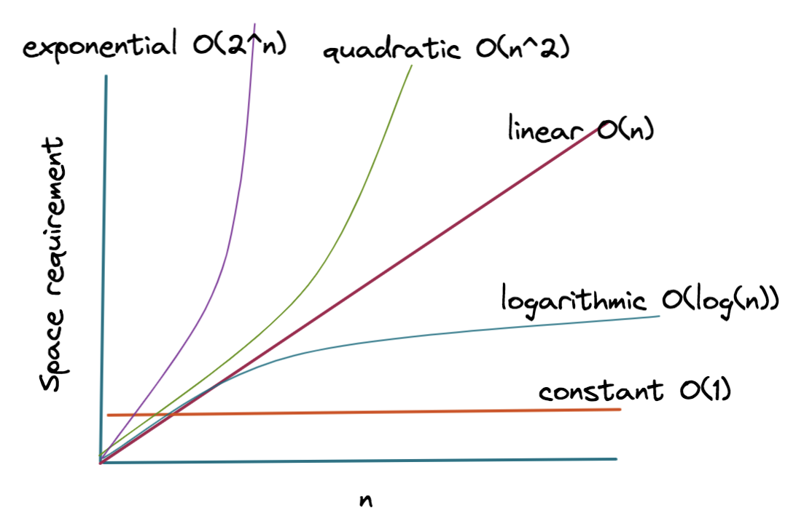

# big-$O$

# 時間計算量
入力のサイズ（$n$）に対して，アルゴリズムが完了するまでにかかるステップ数を表したもの。$n$が増えたとき処理時間がどれくらい増えるのかを示す目安になる。

| 記法 | 説明 | 例 |
| - | - | - | 
|$O$(1)	| 定数時間。入力に関係ない | 配列の先頭にアクセス
|$O$(log $n$) | 対数時間 | 二分探索（Binary Search）
|$O$($n$) | 線形時間 | 線形探索（Linear Search）
|$O$($n$ log $n$) | 高速なソート（平均的な）|クイックソート、マージソートなど
|$O$($n²$) | 二重ループ | バブルソート、挿入ソートなど
|$O$($2ⁿ$) | 指数時間（非常に遅い）|再帰的な全探索（ナップサック問題など）

# 空間計算量
アルゴリズムが必要とする追加のメモリ量。入力のサイズ（$n$）に対してどれだけメモリを消費するかを示す。
| 記法 | 説明・例 |
| - | - | 
|$O$(1)	| 変数1個だけ使う → 定数メモリ
|$O$($n$) | 入力のサイズと同じだけの新しい配列を作る
|$O$($n²$) | 2次元配列や距離行列など

