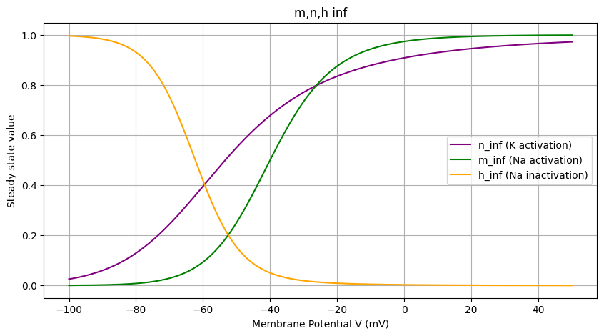
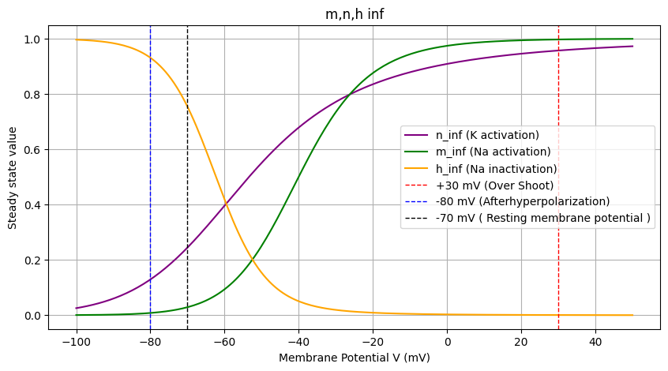
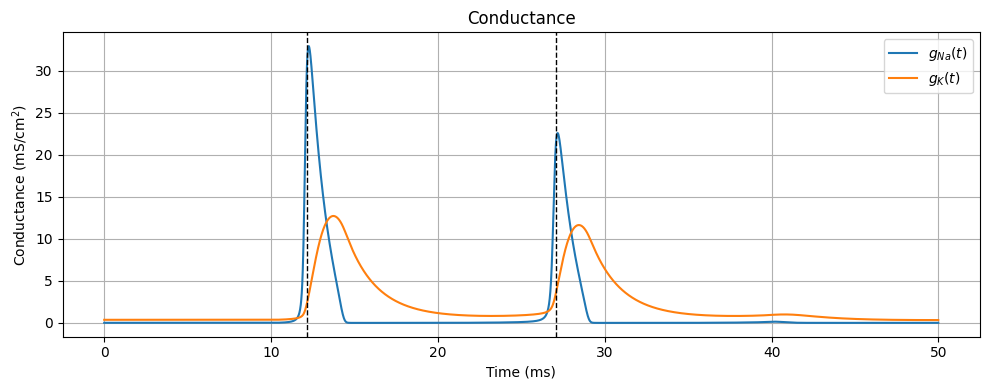

# 猿でもわかるニューロン発火 by Hodgkin,Huxley and Yamashita(2026/07/06)
## 1. 等価回路
$I = C_m \frac{\text{d}V}{\text{d}t} + I_{\text{Na}} + I_{\text{K}} + I_l$

## 2. 登場する連立微分方程式
$$

\begin{aligned}
C\frac{dV}{dt}
&=
-g_{\mathrm{leak}}(V(t)-E_{\mathrm{leak}})
-g_{\mathrm{Na}}(V,t)(V(t)-E_{\mathrm{Na}})
-g_{\mathrm{K}}(V,t)(V(t)-E_{\mathrm{K}})
+I_{\mathrm{ext}}(t)
\\[6pt]
\end{aligned}
$$
$$
\begin{cases}
g_{\mathrm{Na}}(V,t)
&=
\bar{g}_{\mathrm{Na}}\,m^{3}(V,t)h(V,t)
\\[6pt]
g_{\mathrm{K}}(V,t)
&=
\bar{g}_{\mathrm{K}}\,n^{4}(V,t)
\end{cases}
$$

$$
\begin{cases}
\frac{d}{dt} m(V,t) &= \alpha_m(V)(1 - m(V,t)) - \beta_m(V)m(V,t) \\
\frac{d}{dt} h(V,t) &= \alpha_h(V)(1 - h(V,t)) - \beta_h(V)h(V,t) \\
\frac{d}{dt} n(V,t) &= \alpha_n(V)(1 - n(V,t)) - \beta_n(V)n(V,t)
\end{cases}
$$
$$
\begin{cases}
\alpha_m(V) &= \frac{2.5 - 0.1V}{\exp(2.5 - 0.1V) - 1} \\[1.5ex]
\beta_m(V) &= 4 \exp\left(-\frac{V}{18}\right) \\[1.5ex]
\alpha_h(V) &= 0.07 \exp\left(-\frac{V}{20}\right) \\[1.5ex]
\beta_h(V) &= \frac{1}{\exp(3 - 0.1V) + 1} \\[1.5ex]
\alpha_n(V) &= \frac{0.1 - 0.001V}{\exp(1 - 0.1V) - 1} \\[1.5ex]
\beta_n(V) &= 0.125 \exp\left(-\frac{V}{80}\right)
\end{cases}
$$

| 変数                      | 単位                            | 役割                              |
| ----------------------- | ----------------------------- | ------------------------------- |
| $V$                     | mV                            | 膜電位                             |
| $t$                     | ms                            | 時間                              |
| $C$                     | $\mu\mathrm{F}/\mathrm{cm}^2$ | 細胞膜容量                           |
| $I_{\mathrm{ext}}$      | $\mu\mathrm{A}/\mathrm{cm}^2$ | 外部から印加する入力電流                    |
| $I_{\mathrm{Na}}$       | $\mu\mathrm{A}/\mathrm{cm}^2$ | $\mathrm{Na}^{+}$電流             |
| $I_{\mathrm{K}}$        | $\mu\mathrm{A}/\mathrm{cm}^2$ | $\mathrm{K}^{+}$電流              |
| $I_{\mathrm{leak}}$     | $\mu\mathrm{A}/\mathrm{cm}^2$ | リーク電流                           |
| $g_{\mathrm{Na}}$       | $\mathrm{mS}/\mathrm{cm}^2$   | ナトリウムチャネルのコンダクタンス               |
| $g_{\mathrm{K}}$        | $\mathrm{mS}/\mathrm{cm}^2$   | カリウムチャネルのコンダクタンス                |
| $g_{\mathrm{leak}}$     | $\mathrm{mS}/\mathrm{cm}^2$   | リークチャネルのコンダクタンス                 |
| $\bar{g}_{\mathrm{Na}}$ | $\mathrm{mS}/\mathrm{cm}^2$   | ナトリウムチャネルの最大コンダクタンス             |
| $\bar{g}_{\mathrm{K}}$  | $\mathrm{mS}/\mathrm{cm}^2$   | カリウムチャネルの最大コンダクタンス              |
| $E_{\mathrm{Na}}$       | mV                            | $\mathrm{Na}^{+}$イオンの平衡電位（反転電位） |
| $E_{\mathrm{K}}$        | mV                            | $\mathrm{K}^{+}$イオンの平衡電位（反転電位）  |
| $E_{\mathrm{leak}}$     | mV                            | リークチャネルの平衡電位                    |
| $m$                     | --                            | $\mathrm{Na}^{+}$チャネルの活性化ゲート変数  |
| $h$                     | --                            | $\mathrm{Na}^{+}$チャネルの不活性化ゲート変数 |
| $n$                     | --                            | $\mathrm{K}^{+}$チャネルの活性化ゲート変数   |

## 3. ゲート変数の挙動
$g_{\text{Na}}$ と $g_{\text{K}}$ の挙動を記述するため，電位に依存的し，[0,1)の範囲で動く3つの無次元のゲート変数（$m, n, h$）を導入した。
- $n$ （$\text{k}^+$ゲート活性化）：Vが大きくなると，大きくなる（mより遅い）
- $m$ （$\text{Na}^+$ゲート活性化）：Vが大きくなると，大きくなる（n,hより早い）
- $h$ （$\text{Na}^+$ゲート不活性化）：Vが大きくなると，小さくなる（mより遅い）

グラフ１Hodgkin-Huksleyモデルで登場する連立微分方程式を数値計算して$m-V$,$n-V$,$h-V$グラフにしたもの。

## シミュレーション結果

$$
\begin{cases}
g_{\mathrm{Na}}
&=
\bar{g}_{\mathrm{Na}}\,m^{3}h
\\[6pt]
g_{\mathrm{K}}
&=
\bar{g}_{\mathrm{K}}\,n^{4}
\end{cases}
$$

- 入力電流に$I_{ext}$により，膜電位が-70mVより上昇（脱分極開始）
- mが急上昇
    - $g_{\mathrm{Na}}$にはmが三乗されているため影響がつよい。
- $g_{\mathrm{Na}}$上昇
- $\text{Na}^+$電流が強くなる（$I_{Na} = g_{\mathrm{Na}}(V-E_{\mathrm{Na}})$）
- さらに膜電位が上昇（スパイクが起きる）
    - $m\approx1.0$
- $h$が0.6から0.1まで下がる
    - $\text{Na}^+$流入が減る
- 次に$n$が上昇
- $g_{\mathrm{K}}=\bar{g}_{\mathrm{K}}\,n^{4}$ が上昇
- $\text{K}^+$電流が強くなる（$I_{Na} = g_{\mathrm{K}}(V-E_{\mathrm{K}})$）
- 膜電位下降
- 静止膜電位まで下りたころには，mもhも低い値
- $\text{K}^+$による過分極
- 膜電位が下がったことで，hが0.4程度まで上がり，nが0.4程度まで下がる
- 次の発火へ