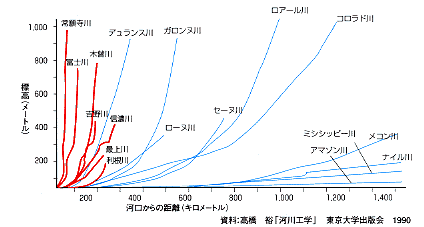
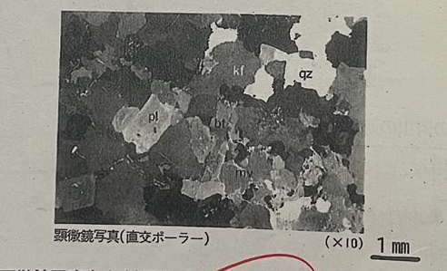

### 1.純度の高い秋吉台の石灰岩はサンゴ礁から形成されています。プレートテクトニクスの視点からこれらがどこで形成され、どのような過程を経ていつ頃現在の位置に定置したかについて説明しなさい。

- サンゴ礁は海洋生物である
    - 秋吉台はもともとサンゴが育ちやすい暖かい気候であった

### 2.以下の用語のうち2つ選んで説明しなさい
###   グーテンベルグ不連続面　三葉虫　活断層　示相化石　中央海嶺　不整合　古地磁気　地層累重の法則

- 活断層
    - 断層に沿って繰り返し地震が起こると、その地形は変異し、変異が認められるものを活断層という。
    - 日本では、関東山地から九州東部に至る西日本を縦断するおおきな中央構造線と呼ばれる断層がある
    - 奈良西側の部分は右横ずれ活断層がある。これはプレートの沈み込みによって生じたもの
    - 活断層はプレートの動きにも影響を受ける

- 中央海嶺
    - 太平洋の中央部や東縁部に急傾斜の細長い凸地形が存在し、このことを中央海嶺という。 
    - 比高2000〜4000ｍの海底山脈となっている。
    - リフト：幅10〜50kmで1000〜1800mの深さをもった深い溝状の地形
        - 地下から吹き出すマグマが冷えて岩石となり海洋プレートが誕生している

### 3.日本で発生する地震の発生場を３つ挙げて説明しなさい。また、2024年1月1日に発生した能登半島地震の属するタイプとその理由について述べなさい
- プレートの境界

- 火山性の地震

- 活断層による地震

### 4.日本と世界の河川の標高と加工からの距離の関係を図1に示す。図を参考に我が国の河川の特徴と自然災害や生活に与える影響と対策について述べなさい

- 日本の川は河口から頂上までの距離が短いが標高は高い
    - 短くて急な川が多い
    - 流れが急
    - 大雨が一気に降ると水害が起こりやすくなる
    - ハザードマップを理解し、水害への理解を深め、早めに避難する
    - 雨が降ったあとは河川に近づかない

### 5.瀬戸内海の海底で36万年〜2.8万年前に生息し、絶滅したナウマンゾウの臼歯が漁師によって引き上げられています。瀬戸内海で発見された地学的意義について気候変化と関連させて説明しなさい。
- 氷河期に日本海は凍結していなかった
- ナウマンゾウは大陸にあったもの。
    - 大昔は日本列島と大陸が一体となっていたことの証拠

### 6.火成岩の顕微鏡写真を見て、この岩石の種類（火山岩、半深成岩、深成岩）と岩石名を答えなさい。また、このような組織を何と呼びますか？

- 深成岩
- かんらん岩
- 完晶質等粒状組織

### 7.プレートテクトニクス理論の根拠となった証拠について2つ挙げて説明しなさい。

### 8.現在、懸念されている二酸化炭素の上昇に伴う地球温暖化において、我々の生活に与えると想定される具体的な影響について2つ挙げ説明しなさい。